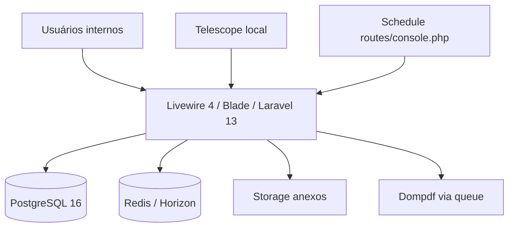
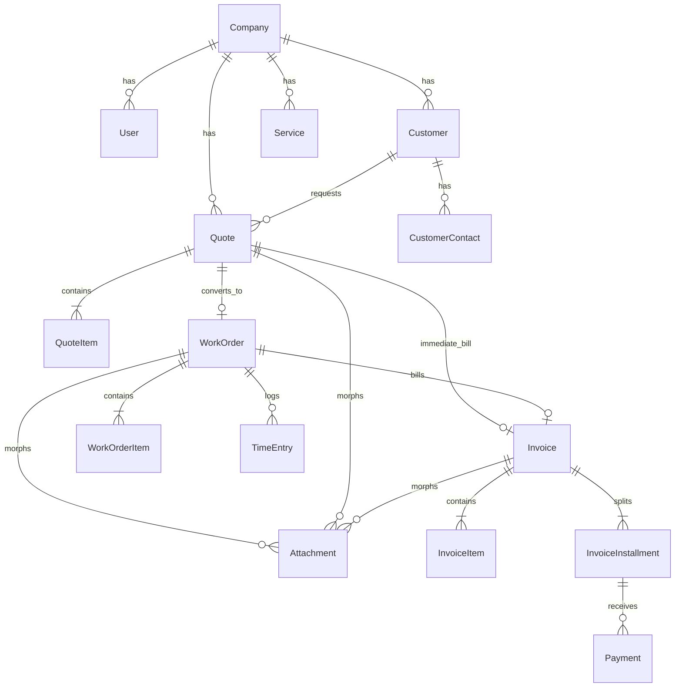
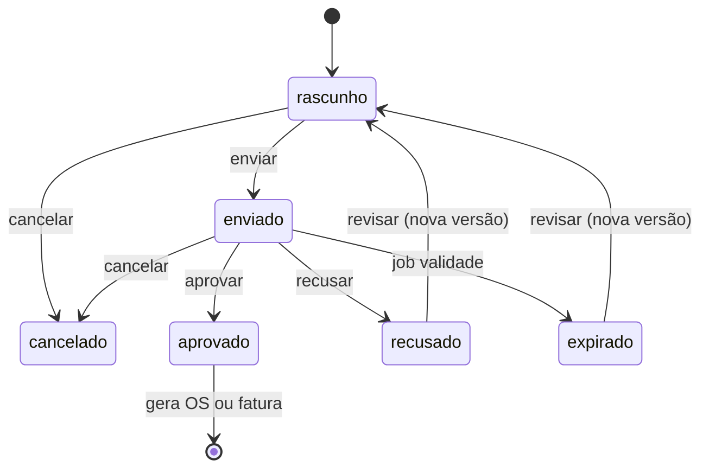
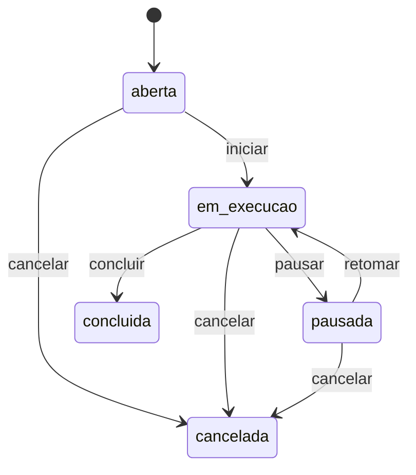
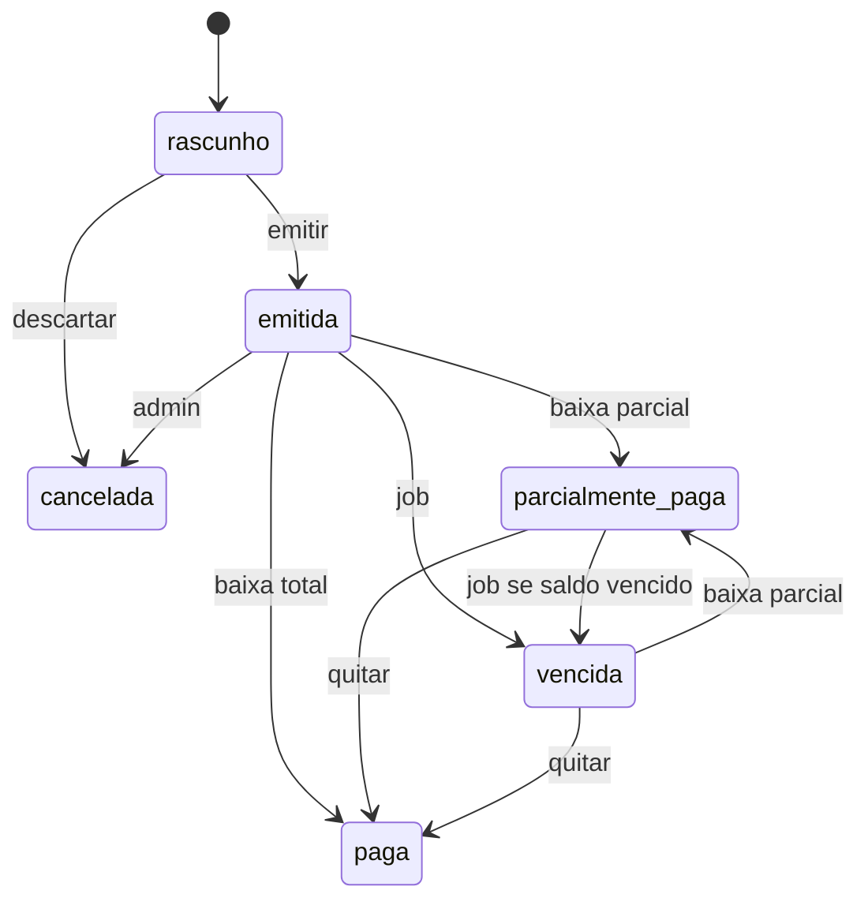

# Spec técnica — Cursor ERP

Complementa o [`prd.md`](./prd.md). Este documento é a base de implementação Laravel: domínio, dados, estados, permissões, PDFs e ordem de construção.

**Status:** planejamento · **App:** Laravel 13 (`^13.0`) · **PHP:** 8.3–8.5  
**Docs de referência:** [laravel.com/docs/13.x](https://laravel.com/docs/13.x) (consultado em 14/08/2026)

---

## 1. Decisões de arquitetura

Alinhadas à documentação atual do Laravel 13 (release 17/03/2026). Laravel 12 saiu de bugfixes em **13/08/2026** e segue só com patches de segurança até 24/02/2027 — projeto novo sobe direto na 13.

| Tema | Decisão | Motivo / fonte |
|---|---|---|
| Framework | Laravel 13 (`^13.0`) | versão atual; breaking changes mínimos; PHP ≥ 8.3 ([releases](https://laravel.com/docs/13.x/releases)) |
| PHP | 8.3+ (alvo 8.4/8.5) | piso do Laravel 13; installer oficial instala 8.5 |
| Banco | PostgreSQL 16 | Laravel 13 suporta PG 10+; JSONB, constraints, `lockForUpdate` ([database](https://laravel.com/docs/13.x/database)) |
| Cache / fila | Redis; Horizon em staging/prod | filas Redis/database oficiais; `Queue::route` para jobs de PDF ([queues](https://laravel.com/docs/13.x/queues)) |
| UI interna | **Livewire 4 + Blade + Flux UI 2** (componentes em classe) | starter kit oficial ([starter kits](https://laravel.com/docs/13.x/starter-kits#livewire), [frontend](https://laravel.com/docs/13.x/frontend#livewire)) |
| Auth | **Fortify** + Spatie Permission + **Policies** Laravel | kit oficial: login, reset, verificação de e-mail, 2FA, passkeys; **sem** registro público ([starter kits — authentication](https://laravel.com/docs/13.x/starter-kits#authentication)) |
| PDF | `barryvdh/laravel-dompdf` (MVP) | A4 simples; Browsershot se o layout exigir |
| Storage | `local` em dev; S3-compatível em prod | `php artisan storage:link` para anexos públicos |
| Front público | nenhum no MVP | link de aprovação = P1 |
| API HTTP | **não** no MVP | P1: `php artisan install:api` (Sanctum) + JSON:API resources nativos do Laravel 13 |
| Multitenancy | **não** no MVP. Toda tabela de negócio tem `company_id` (seed = `1`) | evita retrabalho na P2 |
| Idioma | `APP_LOCALE=pt_BR`, `APP_FAKER_LOCALE=pt_BR`, `APP_TIMEZONE=America/Sao_Paulo` | [configuration](https://laravel.com/docs/13.x/configuration) / [installation](https://laravel.com/docs/13.x/installation) |
| Testes | **Pest 5** (kit oficial Livewire, ago/2026) | Feature tests ([testing](https://laravel.com/docs/13.x/testing)) |
| Qualidade | Pint (preset `laravel`) + Pest no CI | `./vendor/bin/pint --test` e `php artisan test` ([Pint](https://laravel.com/docs/13.x/pint)) |
| DX / agentes | Laravel Boost (`--boost` no `laravel new`) | MCP + guidelines na versão instalada ([Boost](https://laravel.com/docs/13.x/boost)) |
| Dev local | **Sail** (Postgres + Redis) + `composer run dev` | ambiente reproduzível ([Sail](https://laravel.com/docs/13.x/sail)); Herd ok na máquina, o repo padroniza Sail |
| Filas prod | **Horizon** (Redis) | dashboard e supervisor de workers ([Horizon](https://laravel.com/docs/13.x/horizon)) |
| Debug local | **Telescope** (`--dev`) | só local/staging; nunca produção ([Telescope](https://laravel.com/docs/13.x/telescope)) |
| Observabilidade prod | Pulse (P1) · Nightwatch opcional | Pulse é first-party self-hosted; Nightwatch é SaaS pago ([Pulse](https://laravel.com/docs/13.x/pulse)) |
| Deploy | Laravel Cloud **ou** Forge | `php artisan optimize` + `php artisan reload` ([deployment](https://laravel.com/docs/13.x/deployment)) |
| Healthcheck | rota `/up` (default Laravel 13) | load balancer / orquestrador |

### 1.1 O que não usar no MVP

- **Starter kit React/Vue/Svelte.** O playbook [laravel.com/for/agents](https://laravel.com/for/agents) defaulta `--react`. Este produto é backoffice em PHP: **`--livewire --livewire-class-components`**.
- **Filament.** A UI é Livewire + Blade + Flux; Resources/painel `/admin` não entram.
- **Volt / SFC.** Componentes em **classe** (`app/Livewire`) + view Blade (`resources/views/livewire`), não single-file. A árvore `resources/views/pages` da [doc do kit Livewire](https://laravel.com/docs/13.x/starter-kits#livewire-customization) é a variante Volt; não usamos.
- **Teams do starter kit.** O kit Livewire *pode* nascer com teams (`/{current_team}/dashboard`). Este ERP **não** usa isso: uma empresa no MVP, `company_id` nas tabelas, papéis Spatie.
- **WorkOS AuthKit.** Login, senha, reset e 2FA são Fortify nativo. Sem SSO/social no MVP.
- **Telescope em produção.** É ferramenta de debug local.
- Octane, Passport, Scout, Cashier, Reverb, Folio, Mix, Homestead, Nova — fora do problema.
- Registro público no painel (`Features::registration()`). Usuários são criados pelo admin.
- Microserviços, DDD tático pesado, event sourcing, `nwidart/laravel-modules`.
- Soft delete em **documentos numerados**: status `cancelado`. `SoftDeletes` só em cadastros (`Customer`, `Service`, `ServiceCategory`) para ocultar sem quebrar FKs de orçamento/OS/fatura.
- Money como `float`. **`decimal(14,2)`** / `decimal(14,4)` + cast Eloquent `decimal:2` / `decimal:4`. Totais no backend, `ROUND_HALF_UP`.
- PK UUID/ULID, PK composta, `#[Unguarded]` / `$guarded = []`. Eloquent exige um `id` único; unique composto é índice extra, não PK.
- `$table->enum()` nativo para status. Coluna `string` + cast PHP enum — alterar casos não exige `using()` no PostgreSQL nem quebra o sqlite dos testes.
- Editar migration já rodada/commitada. `schema:dump --prune` só depois do MVP, se o diretório inflar.
- `routes/api.php` até o P1 (`install:api`). CSRF do painel permanece; Laravel 13 formalizou `PreventRequestForgery`.

### 1.2 Diagrama de contexto



### 1.3 Convenções Laravel 13 que esta spec segue

Fonte: [installation](https://laravel.com/docs/13.x/installation), [structure](https://laravel.com/docs/13.x/structure), [eloquent](https://laravel.com/docs/13.x/eloquent), [migrations](https://laravel.com/docs/13.x/migrations), [scheduling](https://laravel.com/docs/13.x/scheduling), [queues](https://laravel.com/docs/13.x/queues), [testing](https://laravel.com/docs/13.x/testing).

1. **Criar o app** com `laravel new cursor-erp --livewire --livewire-class-components --database=pgsql --pest --boost --no-interaction`.
2. **Dev:** Sail (pgsql+redis) e `composer run dev` (HTTP + queue + Vite). App autenticado em `/dashboard`. Telescope só nesse ambiente.
3. **Bootstrap:** `bootstrap/app.php` + `bootstrap/providers.php`. Auth: Fortify (`config/fortify.php`).
4. **Schedule** em `routes/console.php` (`Schedule::job(...)->dailyAt('01:00')`), não em `app/Console/Kernel.php` (não existe mais no skeleton).
5. **Jobs** com atributos PHP 8 do framework: `#[Tries(5)]`, `#[Backoff(60)]`, `#[Timeout(120)]`. Roteamento central: `Queue::route(GenerateDocumentPdfJob::class, connection: 'redis', queue: 'pdfs')`.
6. **Policies** geradas com `php artisan make:policy`; Livewire chama `$this->authorize()`.
7. **Models** em `app/Models`. Gerar com `php artisan make:model Quote -mfs --policy` (migration + factory + seeder + policy). **Não** `--all`: não queremos controller — a UI é Livewire. PK bigint autoincremento; **sem** UUID/ULID e **sem** PK composta ([Eloquent](https://laravel.com/docs/13.x/eloquent)).
8. **Enums** backed string + cast Eloquent (`QuoteStatus::class`). Datas de negócio: `immutable_date` / `immutable_datetime`.
9. **Testes:** a maioria em `tests/Feature`. Rodar `php artisan test`. Paralelo depois, com `brianium/paratest`.
10. **Boost** na criação (`laravel new … --boost`) para o Cursor consultar a doc na versão instalada.
11. **Migrations** anônimas (`return new class extends Migration`), geradas por Artisan. Deploy: `php artisan migrate --force --isolated`. Testes sqlite com `foreign_key_constraints` ligado ([migrations](https://laravel.com/docs/13.x/migrations)).

### 1.4 Práticas do ecossistema (obrigatórias neste projeto)

Fontes: Eloquent, Queues, Mail, Notifications, Errors, Livewire, Fortify, starter kit.

**Criação (desvio consciente do playbook de agentes)**

```bash
laravel new cursor-erp --livewire --livewire-class-components --database=pgsql --pest --boost --no-interaction
```

Sem `--react`. Pint, Fortify, Flux, Sail (`require-dev`) e Larastan já vêm no kit. **Neste repositório** a Fase 0 já foi aplicada na raiz, preservando `docs/`.

Próximos pacotes (Fase 1+): `spatie/laravel-permission`, Horizon, Telescope `--dev`.

**Eloquent** ([getting started](https://laravel.com/docs/13.x/eloquent))

No `AppServiceProvider::configureDefaults()`, fora de produção:

```php
Model::shouldBeStrict(! app()->isProduction());
```

Isso liga `preventLazyLoading`, `preventSilentlyDiscardingAttributes` e `preventAccessingMissingAttributes` ([strictness](https://laravel.com/docs/13.x/eloquent#configuring-eloquent-strictness)).

Convenções deste ERP:

| Tema | Decisão |
|---|---|
| PK | `id` bigint incrementing. Número comercial (`ORC-…`) **não** é a PK. Sem `HasUuids` / `HasUlids`. |
| Tabela | convenção Eloquent (plural snake). `#[Table]` só se o nome destoar. |
| Mass assignment | `#[Fillable]` + `#[Hidden]` como no `User` do kit. Nunca `#[Unguarded]`. JSON: gravar o objeto inteiro no service; não mass-assign nested `foo->bar` a partir do request. |
| Defaults | `$attributes` no model (formato “como no banco”): `status` rascunho, `revision` => 1, `is_active` => true. |
| Casts | método `casts()`: enums, `decimal:2` / `decimal:4`, `immutable_date` / `immutable_datetime`, JSON `array`. |
| Relacionamentos | método + return type; inverse; FK no filho; `with()` explícito; `chaperone()` nos hasMany de itens. Ver §3.2. |
| Eager load | `with()` / `loadMissing()` por tela. **Não** `automaticallyEagerLoadRelationships()` — o `shouldBeStrict` deve estourar N+1 em dev. |
| Filhos | `$quote->items()->create()`. Comparar models com `$a->is($b)`. `whereBelongsTo($customer)`. |
| Scopes | locais com `#[Scope]` (`forCompany`, `active`, `status`). Sem global scope de empresa no MVP (uma company). Global só o do `SoftDeletes`. |
| Soft delete | cadastros sim; Quote / WorkOrder / Invoice / Payment **não**. |
| Revisão de orçamento | `$quote->replicate([...campos de status/envio...])` + copiar itens; `parent_id` e `revision + 1`. |
| Observers | `php artisan make:observer` + `#[ObservedBy]` no model. Recalcular totais no `saving` do item. |
| Jobs em lote | `lazyById()` (expirar orçamento, marcar fatura vencida). Não `all()`. `cursor()` não faz eager load. |
| Lookup | `findOrFail` / `firstOrFail` nas telas. Seeders podem usar `withoutEvents` se o observer não deve disparar. |
| Factory | `HasFactory` em todo model de domínio. Inspecionar com `php artisan model:show`. |

Transações de agregado: `DB::transaction()`. `lockForUpdate()` na linha de `document_sequences` (que tem `id` PK + unique composto).

**Migrations** ([migrations](https://laravel.com/docs/13.x/migrations))

- Gerar com `php artisan make:migration` / `make:model -m`. Classe anônima, `up()` / `down()` reversível (`dropIfExists`). Sem DML — dados vão no seeder.
- **Não** editar as migrations do kit (`users`, `cache`, `jobs`, 2FA, passkeys). `company_id` / `phone` / `is_active` em `users` entram numa migration `Schema::table` nova.
- FK: `foreignIdFor(Quote::class)` (2º arg se o nome ≠ `{model}_id`). Modifiers (`nullable()`, `default()`) **antes** de `constrained()`. Depois: `restrictOnDelete()` entre documentos/cadastros; `cascadeOnDelete()` em itens/contatos/parcelas/apontamentos; `nullOnDelete()` em FK opcional (`contact_id`, `parent_id`, `category_id`).
- Dinheiro: `decimal('total', total: 14, places: 2)`. Qtd: `places: 4`. Endereço: `jsonb()`. Datas de negócio: `date()` / `timestamp()` + `timestamps()`. Cadastros: `softDeletes()`. Anexos: `morphs('documentable')`.
- Status: `string` + `->default(QuoteStatus::Draft->value)->index()`, **não** `$table->enum()`.
- Índices na create: unique composto, `(company_id, status)`, colunas de job (`valid_until`, `due_date`). Nome explícito se o auto-nome estourar 63 chars no PG.
- XOR da origem da fatura: unique nullable em `quote_id` e `work_order_id` + regra no `InvoiceService`. Sem `CHECK` cru (sqlite de teste).
- SQLite dos testes: `DB_FOREIGN_KEYS=true` (`config/database.php` `foreign_key_constraints`). Produção: `migrate --force --isolated` ([isolating](https://laravel.com/docs/13.x/migrations#isolating-migration-execution)). Sem `schema:dump` no MVP.

**Filas** ([jobs and database transactions](https://laravel.com/docs/13.x/queues#jobs-and-database-transactions))

PDF e e-mail: `ShouldQueue` + `->afterCommit()` depois de gravar o documento. `ShouldBeUnique` no PDF. Horizon em staging/prod; local o `composer run dev` já sobe worker.

**Livewire 4 + Blade** ([starter kits](https://laravel.com/docs/13.x/starter-kits#livewire))

- Kit: Livewire 4, Tailwind, [Flux UI](https://fluxui.dev/). Código do kit vive no app (não se “atualiza” o kit — [FAQ](https://laravel.com/docs/13.x/starter-kits#faq-upgrade)).
- Páginas e formulários em `app/Livewire` + `resources/views/livewire/*.blade.php` (class components). Layout autenticado: **sidebar** em `resources/views/layouts/app.blade.php` (default do kit). Header só se trocarmos para `<x-layouts::app.header>` **e** `flux:main container`.
- Auth layout: **simple** em `resources/views/layouts/auth.blade.php`. Alternativas do kit: `card` e `split`.
- Ações de status chamam `QuoteService` / `InvoiceService`, não gravam status no componente.
- Testes Pest: `livewire(ListQuotes::class)` e HTTP tests nas rotas.
- Anexos: upload Livewire/Blade + disco Laravel (`storage`).

**Fortify (auth do kit)** ([authentication](https://laravel.com/docs/13.x/starter-kits#authentication), [enabling features](https://laravel.com/docs/13.x/starter-kits#enabling-and-disabling-features))

| Feature | Neste ERP |
|---|---|
| `Features::registration()` | **Removido.** `/register` 404. Views de login só usam `Route::has('register')`. |
| `Features::resetPasswords()` | Ligado (AUTH-02). |
| `Features::emailVerification()` | Ligado. `User` implementa `MustVerifyEmail`. Rotas do painel: `auth` + `verified`. Admin cria usuário já verificado. |
| `Features::twoFactorAuthentication()` | Ligado (default do kit: `confirm` + `confirmPassword`). TOTP opcional em Configurações. |
| `Features::passkeys()` | Ligado (default do kit). |

Ações em `app/Actions/Fortify` (`CreateNewUser`, `ResetUserPassword`). Sem registro público, `CreateNewUser` **não** é o caminho de cadastro — Fase 1 cria usuários pelo admin. Rate limit de login/2FA/passkeys em `FortifyServiceProvider` (5/min login). Home Fortify: `/dashboard`.

**Mail / notificação (P1)**

Mailables e `Notification` com `ShouldQueue`. Local: `MAIL_MAILER=log`.

**Segurança e produção**

- `APP_DEBUG=false` em produção ([deployment](https://laravel.com/docs/13.x/deployment#debug-mode)).
- Deploy: `php artisan optimize` + `php artisan reload` (workers/Horizon).
- Health: `/up`.
- Não servir a app fora de `public/`.
- Rate limit no login (Fortify).

**CI**

```text
./vendor/bin/pint --test
php artisan test
```

Pint já vem com `pint.json` do starter kit (preset Laravel).

---

## 2. Estrutura do repositório (alvo)

Estrutura padrão do Laravel 13 + pastas de domínio. Laravel **não** exige onde a classe mora, desde que o Composer autoloade ([structure](https://laravel.com/docs/13.x/structure)); abaixo é a convenção deste projeto.

```
bootstrap/
  app.php
  providers.php
app/
  Enums/
  Models/
  Policies/
  Observers/
  Services/
  Livewire/            # páginas e formulários (classe)
    Quotes/
    WorkOrders/
    Invoices/
  Jobs/
  Providers/
    AppServiceProvider.php
    FortifyServiceProvider.php
database/migrations/
database/factories/
database/seeders/
resources/views/
  layouts/
  livewire/
  pdf/
lang/pt_BR.json
routes/web.php
routes/console.php
docs/prd.md
docs/spec.md
tests/Feature/
tests/Unit/
```

Módulos lógicos (não usar `nwidart/laravel-modules` no MVP): Cadastros, Orçamentos, OS, Financeiro, Relatórios.

---

## 3. Modelo de domínio



### 3.1 Agregados

| Agregado | Raiz | Filhos | Invariantes |
|---|---|---|---|
| Empresa | `Company` | settings | uma ativa no MVP |
| Cliente | `Customer` | `contacts` (endereço = JSON no pai) | documento válido |
| Catálogo | `Service` | — | código único por company |
| Orçamento | `Quote` | `items` | totais = soma dos itens; enviado é imutável |
| OS | `WorkOrder` | `items`, `time_entries`, `attachments` | nasce de quote aprovada (ou imediato) |
| Fatura | `Invoice` | `items`, `installments`, `payments` | soma parcelas = total; origem única |

### 3.2 Relacionamentos Eloquent

Fonte: [eloquent-relationships](https://laravel.com/docs/13.x/eloquent-relationships).

Regras:

1. Cada relação é um **método** com return type (`BelongsTo`, `HasMany`, `HasOne`, `HasManyThrough`, `MorphMany`, `MorphTo`).
2. Sempre definir a **inverse**. FK canônica no **filho**; o pai usa `hasOne` / `hasMany`. Sem FK duplicada nos dois lados.
3. `hasMany` de coleção que a view lê de volta no pai (`$item->quote`): `->chaperone()` ([has many](https://laravel.com/docs/13.x/eloquent-relationships#one-to-many)).
4. Nome da relação ≠ `{model}_id`? Passar o FK: `belongsTo(User::class, 'salesperson_id')`.
5. Filhos se criam pela relação: `$quote->items()->create([...])`, não `QuoteItem::create(['quote_id' => …])`.
6. Filtro: `Quote::whereBelongsTo($customer)` (e o 2º arg se o nome não for `customer`).
7. Migrations: `foreignIdFor(Quote::class)->constrained()`. Itens/contatos/parcelas: `cascadeOnDelete()`. Cliente, orçamento, OS, fatura entre si: `restrictOnDelete()`.
8. Many-to-many de negócio: **nenhum** no MVP. Papéis = Spatie (`belongsToMany` interno do pacote).

| Model | Método | Tipo | Detalhe |
|---|---|---|---|
| `Company` | `users`, `customers`, `services`, `quotes`, `workOrders`, `invoices` | `HasMany` | |
| `User` | `company` | `BelongsTo` | |
| `Customer` | `company` | `BelongsTo` | |
| `Customer` | `contacts` | `HasMany` + `chaperone()` | |
| `Customer` | `primaryContact` | `HasOne` scoped | `contacts()->one()->where('is_primary', true)` + `withAttributes(['is_primary' => true])` |
| `Customer` | `quotes` | `HasMany` | |
| `Customer` | `latestQuote` | `HasOne` of many | `hasOne(Quote::class)->latestOfMany()` |
| `CustomerContact` | `customer` | `BelongsTo` | |
| `Service` | `company`, `category` | `BelongsTo` | category nullable |
| `ServiceCategory` | `services` | `HasMany` | |
| `Quote` | `company`, `customer`, `contact`, `salesperson`, `approvedBy`, `rejectedBy`, `parent` | `BelongsTo` | FKs nomeadas |
| `Quote` | `items` | `HasMany` | `orderBy('position')->chaperone()` |
| `Quote` | `revisions` | `HasMany` | `hasMany(Quote::class, 'parent_id')` |
| `Quote` | `workOrder` | `HasOne` | FK em `work_orders.quote_id` |
| `Quote` | `invoice` | `HasOne` | faturamento imediato; FK em `invoices.quote_id` |
| `QuoteItem` | `quote`, `service` | `BelongsTo` | `$touches = ['quote']` |
| `WorkOrder` | `company`, `customer`, `quote`, `coordinator` | `BelongsTo` | |
| `WorkOrder` | `items`, `timeEntries` | `HasMany` + `chaperone()` | |
| `WorkOrder` | `invoice` | `HasOne` | FK em `invoices.work_order_id` |
| `WorkOrder` | `attachments` | `MorphMany` + `chaperone()` | |
| `Invoice` | `company`, `customer`, `quote`, `workOrder` | `BelongsTo` | quote XOR workOrder |
| `Invoice` | `items`, `installments` | `HasMany` + `chaperone()` | |
| `Invoice` | `payments` | `HasManyThrough` | via `InvoiceInstallment` |
| `InvoiceInstallment` | `invoice` | `BelongsTo` | `$touches = ['invoice']` |
| `InvoiceInstallment` | `payments` | `HasMany` + `chaperone()` | |
| `Payment` | `installment` | `BelongsTo` | |
| `Attachment` | `documentable` | `MorphTo` | |
| `Quote` / `Invoice` | `attachments` | `MorphMany` | mesmo morph |

**Morph map** (quando `Attachment` existir), em `AppServiceProvider`:

```php
Relation::enforceMorphMap([
    'quote' => Quote::class,
    'work_order' => WorkOrder::class,
    'invoice' => Invoice::class,
]);
```

Não persistir FQCN em `documentable_type` ([custom polymorphic types](https://laravel.com/docs/13.x/eloquent-relationships#custom-polymorphic-types)).

**Eager load por tela** (exemplos; ajustar na implementação):

| Tela | `with` / agregados |
|---|---|
| Lista orçamentos | `customer`, `salesperson` + `withCount('items')` |
| Show orçamento / PDF | `customer.contacts`, `items.service`, `salesperson` |
| Lista faturas | `customer` + `withSum('payments', 'amount')` |
| Dashboard | `withCount` filtrado por status, não `all()` + loop |

`loadMissing()` se o model já veio de outro ponto. Sem `$with` default nos agregados grandes (não inflar lista).

**Não usar:** `Model::automaticallyEagerLoadRelationships()` — a doc oferece isso como rede de segurança; neste ERP o N+1 tem que falhar em dev (`preventLazyLoading`). Sem `withDefault()` em vendedor/cliente obrigatórios (esconderia dado faltando).

---

## 4. Enums

```php
enum PersonType: string { case PF = 'pf'; case PJ = 'pj'; }


enum QuoteStatus: string {
    case Draft = 'rascunho';
    case Sent = 'enviado';
    case Approved = 'aprovado';
    case Rejected = 'recusado';
    case Expired = 'expirado';
    case Cancelled = 'cancelado';
}

enum WorkOrderStatus: string {
    case Open = 'aberta';
    case InProgress = 'em_execucao';
    case Paused = 'pausada';
    case Completed = 'concluida';
    case Cancelled = 'cancelada';
}

enum InvoiceStatus: string {
    case Draft = 'rascunho';
    case Issued = 'emitida';
    case PartiallyPaid = 'parcialmente_paga';
    case Paid = 'paga';
    case Overdue = 'vencida';
    case Cancelled = 'cancelada';
}

enum BillingMode: string {
    case RequiresWorkOrder = 'exige_os';
    case Immediate = 'faturamento_imediato';
}

enum Unit: string {
    case Hour = 'hora';
    case Unit = 'un';
    case Sqm = 'm2';
    case Month = 'mes';
    case Job = 'vb'; // verba / preço fechado
}

enum PaymentMethod: string {
    case Pix = 'pix';
    case Boleto = 'boleto';
    case Ted = 'ted';
    case Card = 'cartao';
    case Cash = 'dinheiro';
    case Other = 'outros';
}
```

Nos models, declarar casts no método `casts()` (Laravel 13): enums acima, valores `decimal:2`, quantidades `decimal:4`, datas de negócio `immutable_date` / `immutable_datetime`. JSON de endereço: `array` ou `AsArrayObject`.

---

## 5. Máquinas de estado

Transições só via services (`QuoteService::send()`, etc.), nunca `update(['status' => …])` solto no componente Livewire.

### 5.1 Orçamento



| De | Para | Quem | Efeito |
|---|---|---|---|
| rascunho | enviado | comercial, admin | congela itens, gera PDF, `sent_at` |
| enviado | aprovado | comercial, admin | `approved_at`, `approved_by`; habilita conversão |
| enviado | recusado | comercial, admin | `rejected_at` + motivo |
| enviado | expirado | job | se `valid_until < today` |
| * | cancelado | admin | motivo; não converte |

Revisão: `$original->replicate()` (exclui timestamps de envio/aprovação/status), `parent_id = original.id`, `revision = n+1`, status `rascunho`, mesmos itens. O original permanece.

### 5.2 Ordem de serviço



Concluir: `completed_at`; se já existir fatura ativa da OS, bloqueia nova (FAT-07).

### 5.3 Fatura



`vencida` é status derivado persistido pelo job para filtro rápido; se pagar, recalcula.

---

## 6. Numeração

`NumberGenerator` usa tabela `document_sequences`:

| company_id | document_type | year | last_number |
|---|---|---|---|

Formato: `{PREFIX}-{YEAR}-{PAD6}`  
Prefixos: `ORC`, `OS`, `FAT`.

Transação com `lockForUpdate()` na linha da sequência para evitar buraco/duplicata em concorrência.

Revisão de orçamento: **mesmo `number`**, campo `revision` incrementa. Exibição: `ORC-2026-000123` / `ORC-2026-000123-r2`.

---

## 7. Cálculo de totais

Para cada item:

```
gross = round(qty * unit_price, 2)
discount_amount = discount_type == percent
    ? round(gross * discount_value / 100, 2)
    : round(discount_value, 2)
net = gross - discount_amount
```

Cabeçalho:

```
subtotal_gross = sum(item.gross)
total_discount = sum(item.discount_amount) + header_discount
tax_amount = round((subtotal_gross - total_discount) * tax_rate / 100, 2)  // tax_rate da company, default 0 no MVP
total = subtotal_gross - total_discount + tax_amount
```

Regras:

- `discount_amount` de item não pode ser > `gross`.
- Desconto de cabeçalho no MVP: **não** (só por item). Evita dupla interpretação. P1 se o comercial pedir.
- Recalcular sempre no `saving` do item e no `QuoteService::recalculate(Quote)`.
- Snapshot: ao enviar orçamento / emitir fatura, persistir `*_snapshot` já calculado; PDF lê o snapshot.

---

## 8. Esquema de dados

Convenções Eloquent + Blueprint ([migrations](https://laravel.com/docs/13.x/migrations)): `id()`, `timestamps()`, `company_id` via `foreignIdFor`. **Sem PK composta**. Índices na própria `Schema::create`. Defaults da coluna espelhados em `$attributes` do model.

Ordem: `companies` → `Schema::table('users')` → cadastros → documentos. `down()` dropa filhos primeiro.

Exemplo (orçamento; demais tabelas no mesmo estilo):

```php
Schema::create('quotes', function (Blueprint $table) {
    $table->id();
    $table->foreignIdFor(Company::class)->constrained()->restrictOnDelete();
    $table->foreignIdFor(Customer::class)->constrained()->restrictOnDelete();
    $table->foreignIdFor(CustomerContact::class, 'contact_id')->nullable()->constrained()->nullOnDelete();
    $table->foreignIdFor(User::class, 'salesperson_id')->constrained()->restrictOnDelete();
    $table->string('number');
    $table->unsignedInteger('revision')->default(1);
    $table->foreignIdFor(Quote::class, 'parent_id')->nullable()->constrained()->nullOnDelete();
    $table->string('status')->default(QuoteStatus::Draft->value);
    $table->date('valid_until');
    $table->decimal('total', total: 14, places: 2);
    $table->timestamps();

    $table->unique(['company_id', 'number', 'revision']);
    $table->index(['company_id', 'status']);
    $table->index('valid_until');
});
```

### 8.1 `companies`

| Coluna | Tipo | Notas |
|---|---|---|
| id | bigint | |
| legal_name | string | razão social |
| trade_name | string nullable | |
| tax_id | string(14) | CNPJ só dígitos |
| state_registration | string nullable | IE |
| municipal_registration | string nullable | IM |
| email, phone | string nullable | |
| address_json | jsonb | `$table->jsonb()`: street, number, complement, district, city, state, zip |
| logo_path | string nullable | |
| default_quote_validity_days | int | default 15 |
| max_discount_percent_sales | decimal(5,2) | default 10 |
| tax_rate | decimal(5,2) | default 0 |
| pix_key | string nullable | impresso no PDF da fatura |
| bank_details | text nullable | |

### 8.2 `users`

Padrão Laravel (migration do kit **intocada**) + migration nova: `company_id` (`foreignIdFor` + `restrictOnDelete`), `phone` nullable, `is_active` boolean default true, índice `(company_id, email)` se ainda não coberto pelo unique de e-mail. Papéis no Spatie.

### 8.3 `customers`

| Coluna | Tipo |
|---|---|
| company_id | FK |
| person_type | string | PHP `PersonType`; não `$table->enum()` |
| name | string |
| tax_id | string nullable | CPF/CNPJ dígitos |
| email, phone | nullable |
| notes | text nullable |
| is_active | bool default true |
| billing_address_json | jsonb | `$table->jsonb()` |
| service_address_json | jsonb | |
| deleted_at | timestamp nullable | `softDeletes()` |

Índice: `(company_id, tax_id)`, `(company_id, name)`.

`customer_contacts`: `foreignIdFor(Customer::class)->constrained()->cascadeOnDelete()`, `name`, `role`, `email`, `phone`, `is_primary`.

### 8.4 `service_categories` / `services`

`services`: `company_id`, `category_id` nullable (`nullOnDelete`), `code` unique por company, `name`, `description`, `unit` string, `default_price` / `default_cost` `decimal(14,2)`, `billing_mode` string, `is_active`, `softDeletes()`. `service_categories`: idem `softDeletes()`.

### 8.5 `quotes`

| Coluna | Tipo | Notas |
|---|---|---|
| company_id | FK | |
| customer_id | FK | |
| contact_id | FK nullable | |
| salesperson_id | FK users | |
| number | string | ORC-YYYY-NNNNNN |
| revision | int default 1 | |
| parent_id | FK quotes nullable | revisão anterior |
| status | string | enum |
| valid_until | date | |
| payment_terms | string nullable | texto livre MVP |
| estimated_duration | string nullable | |
| client_notes | text | vai no PDF |
| internal_notes | text | não vai no PDF |
| subtotal_gross, total_discount, tax_amount, total | decimal(14,2) | |
| sent_at, approved_at, rejected_at, expired_at | timestamps nullable | |
| approved_by, rejected_by | FK users nullable | |
| rejection_reason | text nullable | |

Conversão: **não** há `converted_work_order_id` / `converted_invoice_id` no orçamento. A OS aponta para o orçamento (`work_orders.quote_id`); a fatura aponta para a origem (`invoices.quote_id` XOR `invoices.work_order_id`). Inverse: `Quote::workOrder()` / `Quote::invoice()` como `hasOne`.

Unique: `(company_id, number, revision)`.

`quote_items`: `quote_id`, `position`, `service_id` nullable (avulso), `code`, `name`, `description`, `unit`, `qty` decimal(14,4), `unit_price`, `list_price` (tabela), `discount_type` (`percent`\|`amount`), `discount_value`, `gross`, `discount_amount`, `net`, `cost_snapshot` nullable (interno).

### 8.6 `work_orders`

| Coluna | Tipo | Notas |
|---|---|---|
| company_id, customer_id, quote_id | FKs | `quote_id` unique no MVP (uma OS por orçamento; complementar = P1) |
| number | string | unique por company |
| status | string | enum |
| coordinator_id | FK users nullable | |
| scheduled_start, scheduled_end | datetime nullable | |
| location_text | string nullable | |
| notes | text | |
| completed_at | timestamp nullable | |
| cancel_reason | text nullable | |

Fatura da OS: `Invoice::workOrder()` / `WorkOrder::invoice()` via `invoices.work_order_id` — **sem** `work_orders.invoice_id`.

`work_order_items`: snapshot dos itens do orçamento (`source_quote_item_id`).

`time_entries`: `work_order_id`, `user_id`, `worked_on` date, `hours` decimal(6,2) nullable, `qty` decimal(14,4) nullable, `description`.

`attachments`: `$table->morphs('documentable')` + `path`, `original_name`, `mime`, `size`, `uploaded_by` (`foreignIdFor(User::class)`).

### 8.7 `invoices`

| Coluna | Tipo | Notas |
|---|---|---|
| company_id, customer_id | | |
| quote_id, work_order_id | nullable | exatamente um preenchido (XOR). Unique parcial em cada um (FAT-07). |
| number | | |
| status | | |
| issue_date, due_date | date | due_date da 1ª parcela ou à vista |
| notes | text | PDF |
| subtotal_gross, total_discount, tax_amount, total | | |
| amount_paid | decimal(14,2) default 0 | denormalizado |
| nfse_number, nfse_key | string nullable | P1 |
| cancelled_at, cancel_reason | | |

Check: `(quote_id IS NOT NULL) <> (work_order_id IS NOT NULL)` — XOR de origem.

`invoice_items`: analogia a `quote_items`.

`invoice_installments`: `invoice_id`, `number` (1..N), `due_date`, `amount`, `amount_paid`, `status` (`aberta`, `parcial`, `paga`, `vencida`).

`payments`: `installment_id`, `paid_at` date, `amount`, `method`, `reference` (txid/nº boleto), `receipt_path` nullable, `created_by`.

### 8.8 `document_sequences`

| Coluna | Tipo | Notas |
|---|---|---|
| id | bigint PK | Eloquent exige PK simples |
| company_id | FK | |
| document_type | string | `quote` \| `work_order` \| `invoice` |
| year | int | |
| last_number | int | |

Unique: `(company_id, document_type, year)`. Numeração: `lockForUpdate()` nessa linha.

### 8.9 `audit_logs`

`user_id`, `auditable_type/id`, `event` (`created`/`updated`/`status_changed`), `old_values` jsonb, `new_values` jsonb, `ip`, `created_at`.  
Implementação: `owen-it/laravel-auditing` nos models `Quote`, `WorkOrder`, `Invoice`, `Payment` — ou observer próprio se quiser menos dependência. **Preferência:** pacote Spatie Activity Log **ou** Laravel Auditing. Escolha na implementação: **`spatie/laravel-activitylog`**.

---

## 9. Permissões (Spatie)

Papéis: `admin`, `comercial`, `operacao`, `financeiro`, `gestor`.

| Capacidade | admin | comercial | operacao | financeiro | gestor |
|---|---|---|---|---|---|
| empresa / usuários | CRUD | — | — | — | leitura |
| clientes | CRUD | CRUD | leitura | leitura | leitura |
| catálogo | CRUD | leitura | leitura | leitura | leitura |
| orçamento criar/editar rascunho | sim | sim | — | — | — |
| enviar / aprovar / recusar | sim | sim | — | — | leitura |
| desconto > teto comercial | sim | não | — | — | — |
| OS criar (via conversão) / apontar | sim | leitura | sim | leitura | leitura |
| concluir / cancelar OS | sim | — | sim | — | — |
| fatura rascunho / emitir | sim | — | — | sim | leitura |
| registrar pagamento | sim | — | — | sim | leitura |
| cancelar fatura emitida | sim | — | — | sim* | — |
| dashboard gerencial | sim | comercial** | operação** | financeiro** | sim |
| ver custo / margem | sim | não | não | sim | sim |

\* financeiro cancela fatura **sem** pagamento; com pagamento, só admin.  
\** dashboard filtrado ao seu domínio (pipeline vs OS vs a receber).

Policies Laravel espelham a tabela. Livewire chama `$this->authorize()`; rotas usam middleware `can:`.

---

## 10. Serviços de aplicação

### `QuoteService`

- `create`, `updateDraft`, `addItem`, `recalculate`
- `send(Quote): void` — valida ≥1 item, total > 0, gera PDF, status enviado
- `approve`, `reject`, `cancel`
- `revise(Quote): Quote` — `replicate()` + itens; nova revisão rascunho
- `convert(Quote): WorkOrder|Invoice` — cria via `$quote->workOrder()->create()` / `$quote->invoice()->create()` segundo `billing_mode`; se mistos, **exige OS**. Idempotente: `workOrder()->exists()` / `invoice()->exists()`.

### `WorkOrderService`

- `createFromQuote`
- `start`, `pause`, `resume`, `complete`, `cancel`
- `addTimeEntry`

### `InvoiceService`

- `createFromWorkOrder` / `createFromQuote`
- `setInstallments(Invoice, array $plan)` — à vista = 1 parcela no `due_date`
- `issue` — gera PDF, status emitida
- `registerPayment(Installment, DTO)` — atualiza parcela, fatura, `amount_paid`
- `recomputeStatus`
- `cancel`

### `NumberGenerator`

- `next(Company $c, string $type): string`

Idempotência: `convert` e `createFromWorkOrder` usam transação e `lockForUpdate` no documento origem; recusam se `workOrder()` / `invoice()` já existir (unique em `work_orders.quote_id` e `invoices.work_order_id` / `invoices.quote_id`).

---

## 11. Jobs e scheduler

Schedule em `routes/console.php` ([scheduling](https://laravel.com/docs/13.x/scheduling)):

```php
use Illuminate\Support\Facades\Schedule;

Schedule::job(new ExpireQuotesJob)->dailyAt('01:00')->timezone('America/Sao_Paulo')->withoutOverlapping();
Schedule::job(new MarkOverdueInvoicesJob)->dailyAt('01:10')->timezone('America/Sao_Paulo')->withoutOverlapping();
```

| Job | Quando | Ação |
|---|---|---|
| `ExpireQuotesJob` | diário 01:00 | `enviado` + `valid_until < today` → `expirado` |
| `MarkOverdueInvoicesJob` | diário 01:10 | parcelas em aberto com `due_date < today` → `vencida`; fatura idem se saldo > 0 |
| `GenerateDocumentPdfJob` | na fila ao enviar/emitir | gera e grava `pdf_path` |

Jobs de PDF usam atributos do Laravel 13 e roteamento central em `AppServiceProvider`:

```php
#[Tries(5)]
#[Backoff(60)]
#[Timeout(120)]
class GenerateDocumentPdfJob implements ShouldQueue { /* ... */ }

Queue::route(GenerateDocumentPdfJob::class, connection: 'redis', queue: 'pdfs');
```

`ShouldBeUnique` no PDF por `document_type + id`. Dispatch **depois do commit**: `GenerateDocumentPdfJob::dispatch($quote)->afterCommit()`. Falhas em `failed_jobs`; Horizon em staging/prod.

`pdf_path` em `quotes` e `invoices`. Regenerar só em rascunho. Local: `composer run dev` sobe o worker.

---

## 12. PDFs

Blade em `resources/views/pdf/quote.blade.php` e `invoice.blade.php`.

Conteúdo mínimo orçamento: logo, dados da empresa, cliente, número/revisão/validade, tabela de itens, totais, observações ao cliente, responsável, data de emissão.

Fatura: idem + vencimento/parcelas + PIX/dados bancários. **Não** usar a palavra “Nota Fiscal”. Título: **Fatura de serviços**.

---

## 13. Livewire + Blade — telas (MVP)

Rotas autenticadas em `routes/web.php` (`auth`, `verified`). Componentes em classe:

| Componente | Função |
|---|---|
| `Livewire\Customers\Index` / `Edit` | clientes + contatos |
| `Livewire\Services\Index` / `Edit` | catálogo |
| `Livewire\Quotes\Index` / `Edit` / `Show` | orçamentos + ações de status |
| `Livewire\WorkOrders\Index` / `Show` | OS + apontamentos |
| `Livewire\Invoices\Index` / `Show` | faturas, parcelas, pagamentos |
| `Livewire\Settings\...` | já vem no kit (perfil, senha, aparência) |
| `dashboard` (view) | KPIs REL-01..03 |

Layout sidebar Flux (`resources/views/layouts/app.blade.php`). Ações de status chamam services + `DB::transaction`. Testes: `livewire(...)` + `actingAs`. Assert no **banco**.

---

## 14. Validação (Form Requests / Livewire)

- CNPJ/CPF: algoritmo de dígitos (`league/iso3166` não cobre; usar regra custom ou `laravellegends/pt-br-validator`).
- E-mail RFC.
- `qty` > 0; `unit_price` ≥ 0.
- `valid_until` ≥ hoje no envio.
- Soma das parcelas = `invoice.total` (tolerância 0,01).
- Pagamento ≤ saldo da parcela.

---

## 15. Testes (Pest 5) — mínimo para o MVP

A doc do Laravel 13 pede **Feature tests** para fluxos. Testar componentes Livewire e rotas HTTP. Unit só para `Money` / arredondamento puro.

Rodar: `php artisan test`. Paralelo depois: `composer require brianium/paratest --dev`. Jobs: `Queue::fake()`; e-mail: `Notification::fake()` / `Mail::fake()`. Ambiente: `phpunit.xml`; opcional `.env.testing`. Telescope desligado em `testing`.

| Arquivo | Cobre |
|---|---|
| `QuoteTotalsTest` | desconto % e R$, arredondamento |
| `QuoteStateMachineTest` | transições ilegais (editar enviado, aprovar rascunho) |
| `QuoteRevisionTest` | parent/revision |
| `ConvertQuoteToWorkOrderTest` | snapshot de itens, idempotência |
| `InvoiceFromWorkOrderTest` | XOR origem, não faturar 2x |
| `PaymentTest` | parcial, total, status fatura |
| `ExpireQuoteTest` | job |
| `OverdueInvoiceTest` | job |
| `NumberGeneratorTest` | concorrência (2 next na mesma transação simulada) |
| `PermissionTest` | comercial não emite fatura; financeiro não edita catálogo |

Factories (`php artisan make:factory`) para Company, User, Customer, Service, Quote. Todo model de domínio usa `HasFactory`. Seed de papéis nos testes via seeder mínimo ou `beforeEach`.

---

## 16. Seed do ambiente local

1. Empresa demo “Serviços Exemplo Ltda”.
2. Usuários: `admin@local`, `comercial@local`, `operacao@local`, `financeiro@local`, `gestor@local` (senha documentada só em `.env.example`).
3. 2 clientes (PF e PJ), 5 serviços em 2 categorias.
4. 1 orçamento rascunho, 1 enviado, 1 aprovado+OS, 1 fatura emitida com 1 pagamento parcial.

---

## 17. Configuração e ambiente

O installer grava SQLite por default. Este projeto **não** usa SQLite fora de teste opcional — Postgres desde o dia zero.

`.env` relevante ([installation](https://laravel.com/docs/13.x/installation#databases-and-migrations)):

```
APP_NAME="Cursor ERP"
APP_DEBUG=true
APP_LOCALE=pt_BR
APP_FALLBACK_LOCALE=pt_BR
APP_FAKER_LOCALE=pt_BR
APP_TIMEZONE=America/Sao_Paulo
DB_CONNECTION=pgsql
DB_HOST=127.0.0.1
DB_PORT=5432
DB_DATABASE=cursor_erp
QUEUE_CONNECTION=redis
CACHE_STORE=redis
FILESYSTEM_DISK=local
MAIL_MAILER=log
TELESCOPE_ENABLED=true
```

Produção: `APP_DEBUG=false`, `TELESCOPE_ENABLED=false`, `MAIL_MAILER` real (SES/Postmark/etc.), `LOG_LEVEL=error`. Não commitar `.env`.

`config/erp.php`: prefixos de documento, validade padrão, teto de desconto (overridável pela company).

---

## 18. Fases de implementação

Ordem rígida — cada fase mergeável e testável.

| Fase | Entrega | Critério de pronto |
|---|---|---|
| **0** | Starter kit Livewire + Blade (classe) + Fortify sem registro + `MustVerifyEmail` + locale pt_BR + Eloquent `shouldBeStrict` | `/login` e `/dashboard` funcionam, `/register` 404, e-mail não verificado não entra no painel, `/up` 200, `php artisan test` verde |
| **1** | Company, users, roles, settings | AUTH-* |
| **2** | Clientes + contatos | CLI-* |
| **3** | Categorias e serviços | CAT-* |
| **4** | Orçamentos + itens + totais + PDF + estados + revisão + job expirar | ORC-* |
| **5** | OS + apontamentos + anexos | OS-* |
| **6** | Faturas + parcelas + pagamentos + jobs atraso + PDF | FAT-* REC-* |
| **7** | Dashboard KPIs | REL-01..03 |
| **8** | Seed demo + README de setup | piloto local reproduzível |

Não iniciar fase N+1 com testes da fase N vermelhos.

---

## 19. Fora desta spec (ganchos)

Colunas já previstas, sem UI/serviço no MVP:

- `invoices.nfse_number`, `nfse_key`
- `services` recorrentes (`interval` futuro)
- `quotes` token público (`public_token`) para P1-01
- `company_id` em tudo

Integração NFS-e entra como `NfseGateway` interface + adapter; nenhum provedor escolhido agora.

---

## 20. Riscos técnicos

| Risco | Tratamento |
|---|---|
| Race na numeração | lock da sequence na mesma transação do insert |
| Totais divergentes front/back | backend manda; Livewire só exibe |
| PDF lento | job na fila; UI mostra “gerando…” |
| Livewire 4 / Flux / Laravel 13 | starter kit oficial; `livewire/livewire:^4.1` |
| Job dispara antes do commit | sempre `->afterCommit()` em PDF/e-mail após gravar documento |
| Registro público | `Features::registration()` removido do Fortify |
| Teams / WorkOS do kit | não usamos; `company_id` + Fortify nativo |
| Upload grande em campo | limite 10 MB, mime allowlist imagem/PDF |

---

## 21. Definição de pronto do planejamento

Este par PRD + spec está pronto para desenvolvimento quando o time concordar que:

1. o fluxo orçamento → OS → fatura → recebimento está fechado;
2. NFS-e, portal do cliente e recorrência ficam de fora do MVP;
3. a UI do MVP é **Livewire 4 + Blade** (starter kit oficial, componentes em classe), **não** React/Filament;
4. a implementação segue a tabela da seção 18, em Laravel 13, com as práticas da seção 1.4.

Fase 0 está no repositório. Próximo: **Fase 1** (empresa, usuários, papéis).

---

## 22. CI, observabilidade e deploy

**CI (GitHub Actions, a partir da Fase 0):** PHP 8.4, `composer install`, `./vendor/bin/pint --test`, `php artisan test`. Postgres de serviço no workflow quando os testes deixarem de ser sqlite-memory.

**Local:** Telescope. **Staging/prod:** Horizon + log stack. **P1:** Pulse. Nightwatch só se o time quiser SaaS.

**Deploy:** `php artisan migrate --force --isolated`, `php artisan optimize`, `php artisan reload`. Healthcheck `/up`. Document root = `public/`.

---

## 23. Fontes (docs oficiais, 14/08/2026)

| Tema | URL |
|---|---|
| Releases / política de suporte | https://laravel.com/docs/13.x/releases |
| Upgrade 12 → 13 | https://laravel.com/docs/13.x/upgrade |
| Starter kits (Livewire, layouts, Fortify, 2FA, FAQ) | https://laravel.com/docs/13.x/starter-kits |
| Starter kit Livewire (customização) | https://laravel.com/docs/13.x/starter-kits#livewire-customization |
| Frontend Livewire + Blade | https://laravel.com/docs/13.x/frontend |
| Fortify (auth do kit) | https://laravel.com/docs/13.x/fortify |
| Installation (`laravel new`, `composer run dev`) | https://laravel.com/docs/13.x/installation |
| Playbook de agentes (default React — **não** usamos) | https://laravel.com/for/agents |
| Directory structure | https://laravel.com/docs/13.x/structure |
| Database (PG 10+) | https://laravel.com/docs/13.x/database |
| Migrations (`foreignIdFor`, `constrained`, `--isolated`) | https://laravel.com/docs/13.x/migrations |
| Eloquent (models, strictness, Fillable, scopes, observers) | https://laravel.com/docs/13.x/eloquent |
| Eloquent relationships (`with`, chaperone, morph map, hasOne of many) | https://laravel.com/docs/13.x/eloquent-relationships |
| Scheduling (`routes/console.php`) | https://laravel.com/docs/13.x/scheduling |
| Queues (`afterCommit`, unique, atributos) | https://laravel.com/docs/13.x/queues |
| Horizon | https://laravel.com/docs/13.x/horizon |
| Sail | https://laravel.com/docs/13.x/sail |
| Pint | https://laravel.com/docs/13.x/pint |
| Telescope | https://laravel.com/docs/13.x/telescope |
| Pulse | https://laravel.com/docs/13.x/pulse |
| Deployment (`optimize`, `/up`, Cloud/Forge) | https://laravel.com/docs/13.x/deployment |
| Authorization (policies) | https://laravel.com/docs/13.x/authorization |
| Testing (Pest / Feature) | https://laravel.com/docs/13.x/testing |
| Mail / Notifications | https://laravel.com/docs/13.x/mail · https://laravel.com/docs/13.x/notifications |
| Laravel Boost | https://laravel.com/docs/13.x/boost |
| Livewire 4 | https://livewire.laravel.com/docs/4.x |
