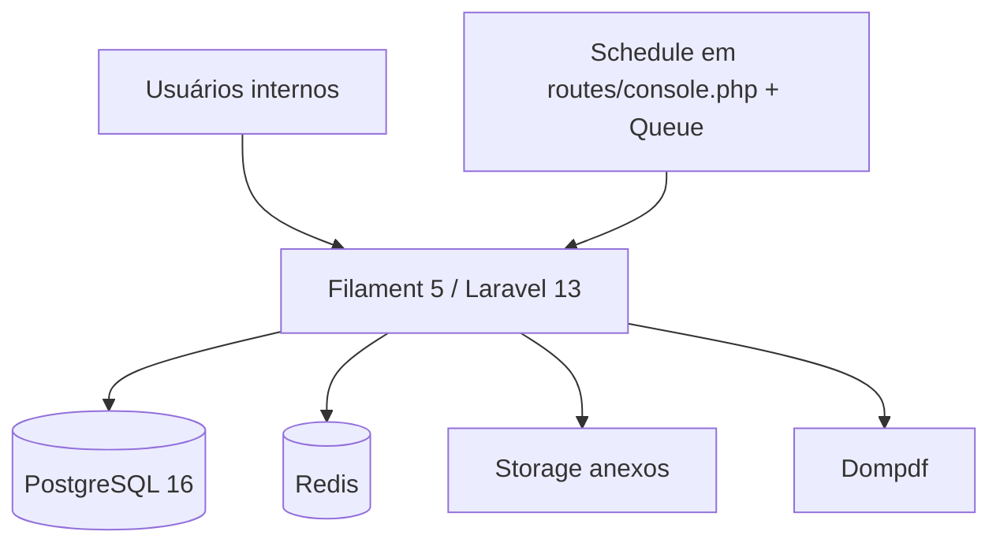
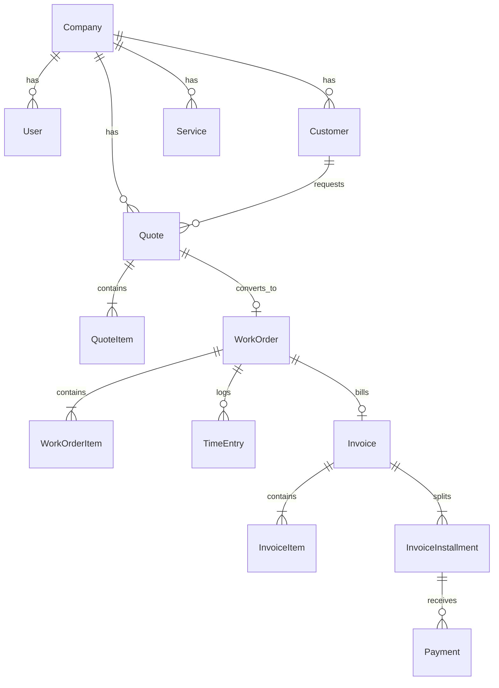
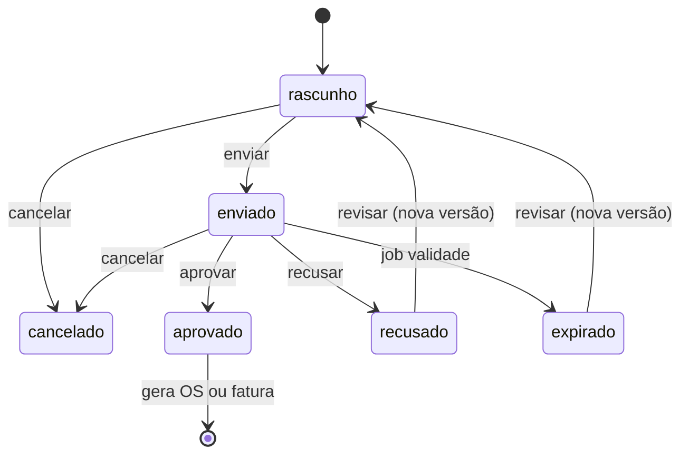
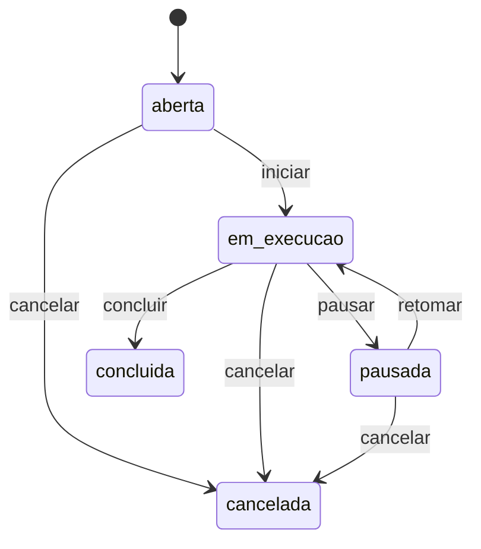
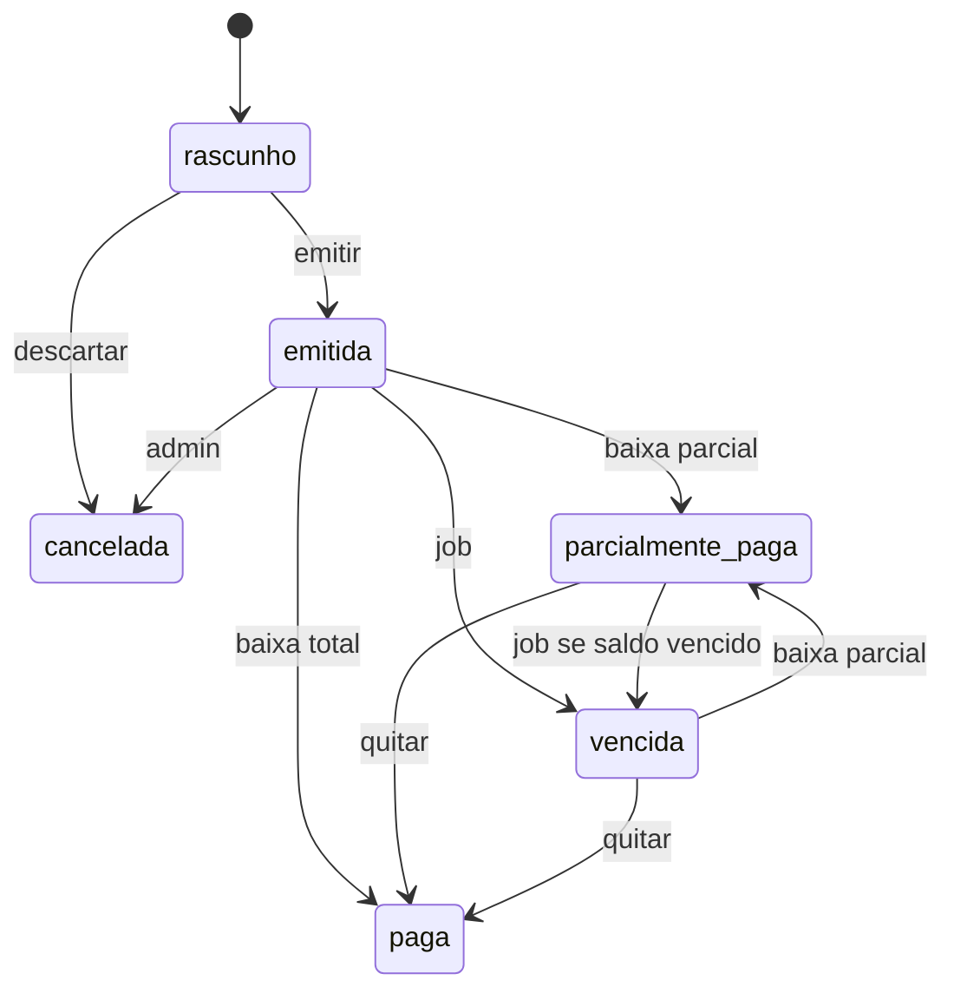

# Spec técnica — Cursor ERP

Complementa o [`prd.md`](./prd.md). Este documento é a base de implementação Laravel: domínio, dados, estados, permissões, PDFs e ordem de construção.

**Status:** planejamento · **App:** Laravel 13 (`^13.0`) · **PHP:** 8.3–8.5  
**Docs de referência:** [laravel.com/docs/13.x](https://laravel.com/docs/13.x) (consultado em 14/08/2026)

---

## 1. Decisões de arquitetura

Alinhadas à documentação atual do Laravel 13 (release 17/03/2026). Laravel 12 saiu de bugfixes em **13/08/2026** e segue só com patches de segurança até 24/02/2027 — projeto novo sobe direto na 13.

| Tema | Decisão | Motivo / fonte |
|---|---|---|
| Framework | Laravel 13 (`^13.0`) | versão atual; breaking changes mínimos; PHP ≥ 8.3 ([releases](https://laravel.com/docs/13.x/releases)) |
| PHP | 8.3+ (alvo 8.4/8.5) | piso do Laravel 13; installer oficial instala 8.5 |
| Banco | PostgreSQL 16 | Laravel 13 suporta PG 10+; JSONB, constraints, `lockForUpdate` ([database](https://laravel.com/docs/13.x/database)) |
| Cache / fila | Redis; Horizon em staging/prod | filas Redis/database oficiais; `Queue::route` para jobs de PDF ([queues](https://laravel.com/docs/13.x/queues)) |
| UI interna | **Filament 5** (`^5.0`) + Livewire 4 + Tailwind 4.1+ | painel `/admin`; v5 é o atual para app novo ([install Filament 5](https://filamentphp.com/docs/5.x/introduction/installation)) |
| Auth | sessão do painel Filament + Spatie Permission + **Policies** Laravel | authorization por policy, não por if solto ([authorization](https://laravel.com/docs/13.x/authorization)) |
| PDF | `barryvdh/laravel-dompdf` (MVP) | A4 simples; Browsershot se o layout exigir |
| Storage | `local` em dev; S3-compatível em prod | `php artisan storage:link` para anexos públicos |
| Front público | nenhum no MVP | link de aprovação = P1 |
| API HTTP | **não** no MVP | P1: `php artisan install:api` (Sanctum) + JSON:API resources nativos do Laravel 13 |
| Multitenancy | **não** no MVP. Toda tabela de negócio tem `company_id` (seed = `1`) | evita retrabalho na P2 |
| Idioma | `APP_LOCALE=pt_BR`, `APP_FAKER_LOCALE=pt_BR`, `APP_TIMEZONE=America/Sao_Paulo` | [configuration](https://laravel.com/docs/13.x/configuration) / [installation](https://laravel.com/docs/13.x/installation) |
| Testes | **Pest 4** (PHPUnit 12 por baixo) | default do `laravel new`; a maioria dos testes é Feature ([testing](https://laravel.com/docs/13.x/testing)) |
| Qualidade | Laravel Pint | formatter oficial |
| DX / agentes | Laravel Boost (`--dev`) | MCP + guidelines versionadas para Cursor ([AI](https://laravel.com/docs/13.x/ai)) |
| Dev local | `laravel new` + `composer run dev` | sobe HTTP, queue worker e Vite; default do installer é SQLite — trocamos para pgsql |

### 1.1 O que não usar no MVP

- Starter kits Inertia/Vue/React/Svelte (custo alto para backoffice interno). Livewire starter kit também não: o painel é Filament.
- Laravel AI SDK, embeddings, `whereVectorSimilarTo` / pgvector — úteis depois (busca de catálogo), irrelevantes para o fluxo financeiro.
- Microserviços, DDD tático pesado, event sourcing.
- Soft delete em **documentos numerados** (orçamento/OS/fatura): usar status `cancelado`. Soft delete só em cadastros (cliente, serviço) se fizer sentido.
- Money como `float`. Decisão: **`decimal(14,2)`** nos valores e `decimal(14,4)` na quantidade; no Eloquent, cast `decimal:2` / `decimal:4` ([mutators](https://laravel.com/docs/13.x/eloquent-mutators#attribute-casting)). Totais no backend com `ROUND_HALF_UP`. `Brick\Money` só se a complexidade crescer.
- `routes/api.php` até o P1 (`install:api`). CSRF no painel continua o default; Laravel 13 formalizou `PreventRequestForgery` (compatível com token CSRF).

### 1.2 Diagrama de contexto



### 1.3 Convenções Laravel 13 que esta spec segue

Fonte: [installation](https://laravel.com/docs/13.x/installation), [structure](https://laravel.com/docs/13.x/structure), [scheduling](https://laravel.com/docs/13.x/scheduling), [queues](https://laravel.com/docs/13.x/queues), [testing](https://laravel.com/docs/13.x/testing).

1. **Criar o app** com `laravel new cursor-erp` (installer atualizado). Escolher **Pest** e **PostgreSQL**. Não usar o SQLite default em ambiente de time.
2. **Dev:** `composer run dev` (HTTP + queue + Vite). Painel em `/admin`.
3. **Bootstrap:** `bootstrap/app.php` + `bootstrap/providers.php`. O Filament registra `App\Providers\Filament\AdminPanelProvider` aí — se o `/admin` 404, conferir esse arquivo.
4. **Schedule** em `routes/console.php` (`Schedule::job(...)->dailyAt('01:00')`), não em `app/Console/Kernel.php` (não existe mais no skeleton).
5. **Jobs** com atributos PHP 8 do framework: `#[Tries(5)]`, `#[Backoff(60)]`, `#[Timeout(120)]`. Roteamento central: `Queue::route(GenerateDocumentPdfJob::class, connection: 'redis', queue: 'pdfs')`.
6. **Policies** geradas com `php artisan make:policy`; Filament consulta `canViewAny` / `canUpdate` etc.
7. **Enums** backed string + cast Eloquent (`QuoteStatus::class`). Datas de negócio: `immutable_date` / `immutable_datetime`.
8. **Testes:** a maioria em `tests/Feature` (a doc recomenda Feature, não Unit, para confiança de fluxo). Rodar `php artisan test`. Paralelo depois, com `brianium/paratest`.
9. **Boost** na Fase 0 (`composer require laravel/boost --dev && php artisan boost:install`) para o Cursor consultar a doc na versão instalada, não uma 12.x antiga.

---

## 2. Estrutura do repositório (alvo)

Estrutura padrão do Laravel 13 + pastas de domínio. Laravel **não** exige onde a classe mora, desde que o Composer autoloade ([structure](https://laravel.com/docs/13.x/structure)); abaixo é a convenção deste projeto.

```
bootstrap/
  app.php
  providers.php
app/
  Enums/
  Models/
  Policies/
  Observers/
  Services/            # regras de conversão e totais (não HTTP)
    QuoteService.php
    WorkOrderService.php
    InvoiceService.php
    NumberGenerator.php
    Money.php
  Jobs/
  Providers/
    AppServiceProvider.php
    Filament/AdminPanelProvider.php
  Filament/            # Resources, Pages, Widgets (gerado pelo Filament)
database/migrations/
database/factories/
database/seeders/
resources/views/pdf/
routes/web.php
routes/console.php     # schedule + comandos closure
docs/prd.md
docs/spec.md
tests/Feature/
tests/Unit/
```

Módulos lógicos (não usar `nwidart/laravel-modules` no MVP): Cadastros, Orçamentos, OS, Financeiro, Relatórios.

---

## 3. Modelo de domínio



### 3.1 Agregados

| Agregado | Raiz | Filhos | Invariantes |
|---|---|---|---|
| Empresa | `Company` | settings | uma ativa no MVP |
| Cliente | `Customer` | `contacts`, `addresses` | documento válido |
| Catálogo | `Service` | — | código único por company |
| Orçamento | `Quote` | `items` | totais = soma dos itens; enviado é imutável |
| OS | `WorkOrder` | `items`, `time_entries`, `attachments` | nasce de quote aprovada (ou imediato) |
| Fatura | `Invoice` | `items`, `installments`, `payments` | soma parcelas = total; origem única |

---

## 4. Enums

```php
enum PersonType: string { case PF = 'pf'; case PJ = 'pj'; }


enum QuoteStatus: string {
    case Draft = 'rascunho';
    case Sent = 'enviado';
    case Approved = 'aprovado';
    case Rejected = 'recusado';
    case Expired = 'expirado';
    case Cancelled = 'cancelado';
}

enum WorkOrderStatus: string {
    case Open = 'aberta';
    case InProgress = 'em_execucao';
    case Paused = 'pausada';
    case Completed = 'concluida';
    case Cancelled = 'cancelada';
}

enum InvoiceStatus: string {
    case Draft = 'rascunho';
    case Issued = 'emitida';
    case PartiallyPaid = 'parcialmente_paga';
    case Paid = 'paga';
    case Overdue = 'vencida';
    case Cancelled = 'cancelada';
}

enum BillingMode: string {
    case RequiresWorkOrder = 'exige_os';
    case Immediate = 'faturamento_imediato';
}

enum Unit: string {
    case Hour = 'hora';
    case Unit = 'un';
    case Sqm = 'm2';
    case Month = 'mes';
    case Job = 'vb'; // verba / preço fechado
}

enum PaymentMethod: string {
    case Pix = 'pix';
    case Boleto = 'boleto';
    case Ted = 'ted';
    case Card = 'cartao';
    case Cash = 'dinheiro';
    case Other = 'outros';
}
```

Nos models, declarar casts no método `casts()` (Laravel 13): enums acima, valores `decimal:2`, quantidades `decimal:4`, datas de negócio `immutable_date` / `immutable_datetime`. JSON de endereço: `array` ou `AsArrayObject`.

---

## 5. Máquinas de estado

Transições só via services (`QuoteService::send()`, etc.), nunca `update(['status' => …])` solto nas pages Filament.

### 5.1 Orçamento



| De | Para | Quem | Efeito |
|---|---|---|---|
| rascunho | enviado | comercial, admin | congela itens, gera PDF, `sent_at` |
| enviado | aprovado | comercial, admin | `approved_at`, `approved_by`; habilita conversão |
| enviado | recusado | comercial, admin | `rejected_at` + motivo |
| enviado | expirado | job | se `valid_until < today` |
| * | cancelado | admin | motivo; não converte |

Revisão: cria **novo** `quotes` com `parent_id` e `revision = n+1`, status `rascunho`, mesmos itens. O original permanece.

### 5.2 Ordem de serviço



Concluir: `completed_at`; se já existir fatura ativa da OS, bloqueia nova (FAT-07).

### 5.3 Fatura



`vencida` é status derivado persistido pelo job para filtro rápido; se pagar, recalcula.

---

## 6. Numeração

`NumberGenerator` usa tabela `document_sequences`:

| company_id | document_type | year | last_number |
|---|---|---|---|

Formato: `{PREFIX}-{YEAR}-{PAD6}`  
Prefixos: `ORC`, `OS`, `FAT`.

Transação com `lockForUpdate()` na linha da sequência para evitar buraco/duplicata em concorrência.

Revisão de orçamento: **mesmo `number`**, campo `revision` incrementa. Exibição: `ORC-2026-000123` / `ORC-2026-000123-r2`.

---

## 7. Cálculo de totais

Para cada item:

```
gross = round(qty * unit_price, 2)
discount_amount = discount_type == percent
    ? round(gross * discount_value / 100, 2)
    : round(discount_value, 2)
net = gross - discount_amount
```

Cabeçalho:

```
subtotal_gross = sum(item.gross)
total_discount = sum(item.discount_amount) + header_discount
tax_amount = round((subtotal_gross - total_discount) * tax_rate / 100, 2)  // tax_rate da company, default 0 no MVP
total = subtotal_gross - total_discount + tax_amount
```

Regras:

- `discount_amount` de item não pode ser > `gross`.
- Desconto de cabeçalho no MVP: **não** (só por item). Evita dupla interpretação. P1 se o comercial pedir.
- Recalcular sempre no `saving` do item e no `QuoteService::recalculate(Quote)`.
- Snapshot: ao enviar orçamento / emitir fatura, persistir `*_snapshot` já calculado; PDF lê o snapshot.

---

## 8. Esquema de dados

Convenções: `id` bigint PK, `timestamps`, `company_id` FK onde couber, índices listados.

### 8.1 `companies`

| Coluna | Tipo | Notas |
|---|---|---|
| id | bigint | |
| legal_name | string | razão social |
| trade_name | string nullable | |
| tax_id | string(14) | CNPJ só dígitos |
| state_registration | string nullable | IE |
| municipal_registration | string nullable | IM |
| email, phone | string nullable | |
| address_json | jsonb | street, number, complement, district, city, state, zip |
| logo_path | string nullable | |
| default_quote_validity_days | int | default 15 |
| max_discount_percent_sales | decimal(5,2) | default 10 |
| tax_rate | decimal(5,2) | default 0 |
| pix_key | string nullable | impresso no PDF da fatura |
| bank_details | text nullable | |

### 8.2 `users`

Padrão Laravel + `company_id`, `name`, `email`, `is_active`, `phone`. Papéis no Spatie.

### 8.3 `customers`

| Coluna | Tipo |
|---|---|
| company_id | FK |
| person_type | enum pf/pj |
| name | string |
| tax_id | string nullable | CPF/CNPJ dígitos |
| email, phone | nullable |
| notes | text nullable |
| is_active | bool default true |
| billing_address_json | jsonb |
| service_address_json | jsonb |

Índice: `(company_id, tax_id)`, `(company_id, name)`.

`customer_contacts`: `customer_id`, `name`, `role`, `email`, `phone`, `is_primary`.

### 8.4 `service_categories` / `services`

`services`: `company_id`, `category_id` nullable, `code` unique por company, `name`, `description`, `unit`, `default_price`, `default_cost`, `billing_mode`, `is_active`.

### 8.5 `quotes`

| Coluna | Tipo | Notas |
|---|---|---|
| company_id | FK | |
| customer_id | FK | |
| contact_id | FK nullable | |
| salesperson_id | FK users | |
| number | string | ORC-YYYY-NNNNNN |
| revision | int default 1 | |
| parent_id | FK quotes nullable | revisão anterior |
| status | string | enum |
| valid_until | date | |
| payment_terms | string nullable | texto livre MVP |
| estimated_duration | string nullable | |
| client_notes | text | vai no PDF |
| internal_notes | text | não vai no PDF |
| subtotal_gross, total_discount, tax_amount, total | decimal(14,2) | |
| sent_at, approved_at, rejected_at, expired_at | timestamps nullable | |
| approved_by, rejected_by | FK users nullable | |
| rejection_reason | text nullable | |
| converted_work_order_id | FK nullable | preenchido na conversão |
| converted_invoice_id | FK nullable | faturamento imediato |

Unique: `(company_id, number, revision)`.

`quote_items`: `quote_id`, `position`, `service_id` nullable (avulso), `code`, `name`, `description`, `unit`, `qty` decimal(14,4), `unit_price`, `list_price` (tabela), `discount_type` (`percent`\|`amount`), `discount_value`, `gross`, `discount_amount`, `net`, `cost_snapshot` nullable (interno).

### 8.6 `work_orders`

| Coluna | Tipo |
|---|---|
| company_id, customer_id, quote_id | FKs |
| number | unique por company |
| status | |
| coordinator_id | FK users nullable |
| scheduled_start, scheduled_end | datetime nullable |
| location_text | string nullable |
| notes | text |
| completed_at | |
| cancel_reason | |
| invoice_id | FK nullable |

`work_order_items`: snapshot dos itens do orçamento (`source_quote_item_id`).

`time_entries`: `work_order_id`, `user_id`, `worked_on` date, `hours` decimal(6,2) nullable, `qty` decimal(14,4) nullable, `description`.

`attachments`: polimórfico `documentable_type/id`, `path`, `original_name`, `mime`, `size`, `uploaded_by`.

### 8.7 `invoices`

| Coluna | Tipo | Notas |
|---|---|---|
| company_id, customer_id | | |
| quote_id, work_order_id | nullable | exatamente um preenchido |
| number | | |
| status | | |
| issue_date, due_date | date | due_date da 1ª parcela ou à vista |
| notes | text | PDF |
| subtotal_gross, total_discount, tax_amount, total | | |
| amount_paid | decimal(14,2) default 0 | denormalizado |
| nfse_number, nfse_key | string nullable | P1 |
| cancelled_at, cancel_reason | | |

Check: `(quote_id IS NOT NULL) <> (work_order_id IS NOT NULL)` — XOR de origem.

`invoice_items`: analogia a `quote_items`.

`invoice_installments`: `invoice_id`, `number` (1..N), `due_date`, `amount`, `amount_paid`, `status` (`aberta`, `parcial`, `paga`, `vencida`).

`payments`: `installment_id`, `paid_at` date, `amount`, `method`, `reference` (txid/nº boleto), `receipt_path` nullable, `created_by`.

### 8.8 `document_sequences`

`company_id`, `document_type` (`quote`\|`work_order`\|`invoice`), `year`, `last_number`. Unique composto.

### 8.9 `audit_logs`

`user_id`, `auditable_type/id`, `event` (`created`/`updated`/`status_changed`), `old_values` jsonb, `new_values` jsonb, `ip`, `created_at`.  
Implementação: `owen-it/laravel-auditing` nos models `Quote`, `WorkOrder`, `Invoice`, `Payment` — ou observer próprio se quiser menos dependência. **Preferência:** pacote Spatie Activity Log **ou** Laravel Auditing. Escolha na implementação: **`spatie/laravel-activitylog`**.

---

## 9. Permissões (Spatie)

Papéis: `admin`, `comercial`, `operacao`, `financeiro`, `gestor`.

| Capacidade | admin | comercial | operacao | financeiro | gestor |
|---|---|---|---|---|---|
| empresa / usuários | CRUD | — | — | — | leitura |
| clientes | CRUD | CRUD | leitura | leitura | leitura |
| catálogo | CRUD | leitura | leitura | leitura | leitura |
| orçamento criar/editar rascunho | sim | sim | — | — | — |
| enviar / aprovar / recusar | sim | sim | — | — | leitura |
| desconto > teto comercial | sim | não | — | — | — |
| OS criar (via conversão) / apontar | sim | leitura | sim | leitura | leitura |
| concluir / cancelar OS | sim | — | sim | — | — |
| fatura rascunho / emitir | sim | — | — | sim | leitura |
| registrar pagamento | sim | — | — | sim | leitura |
| cancelar fatura emitida | sim | — | — | sim* | — |
| dashboard gerencial | sim | comercial** | operação** | financeiro** | sim |
| ver custo / margem | sim | não | não | sim | sim |

\* financeiro cancela fatura **sem** pagamento; com pagamento, só admin.  
\** dashboard filtrado ao seu domínio (pipeline vs OS vs a receber).

Policies Laravel espelham a tabela. Filament `canViewAny` / `canEdit` consultam a policy.

---

## 10. Serviços de aplicação

### `QuoteService`

- `create`, `updateDraft`, `addItem`, `recalculate`
- `send(Quote): void` — valida ≥1 item, total > 0, gera PDF, status enviado
- `approve`, `reject`, `cancel`
- `revise(Quote): Quote` — nova revisão
- `convert(Quote): WorkOrder|Invoice` — segundo `billing_mode` predominante dos itens; se mistos, **exige OS** (mais seguro)

### `WorkOrderService`

- `createFromQuote`
- `start`, `pause`, `resume`, `complete`, `cancel`
- `addTimeEntry`

### `InvoiceService`

- `createFromWorkOrder` / `createFromQuote`
- `setInstallments(Invoice, array $plan)` — à vista = 1 parcela no `due_date`
- `issue` — gera PDF, status emitida
- `registerPayment(Installment, DTO)` — atualiza parcela, fatura, `amount_paid`
- `recomputeStatus`
- `cancel`

### `NumberGenerator`

- `next(Company $c, string $type): string`

Idempotência: `convert` e `createFromWorkOrder` usam transação e checam `converted_*_id` / `invoice_id`.

---

## 11. Jobs e scheduler

Schedule em `routes/console.php` ([scheduling](https://laravel.com/docs/13.x/scheduling)):

```php
use Illuminate\Support\Facades\Schedule;

Schedule::job(new ExpireQuotesJob)->dailyAt('01:00')->timezone('America/Sao_Paulo')->withoutOverlapping();
Schedule::job(new MarkOverdueInvoicesJob)->dailyAt('01:10')->timezone('America/Sao_Paulo')->withoutOverlapping();
```

| Job | Quando | Ação |
|---|---|---|
| `ExpireQuotesJob` | diário 01:00 | `enviado` + `valid_until < today` → `expirado` |
| `MarkOverdueInvoicesJob` | diário 01:10 | parcelas em aberto com `due_date < today` → `vencida`; fatura idem se saldo > 0 |
| `GenerateDocumentPdfJob` | na fila ao enviar/emitir | gera e grava `pdf_path` |

Jobs de PDF usam atributos do Laravel 13 e roteamento central em `AppServiceProvider`:

```php
#[Tries(5)]
#[Backoff(60)]
#[Timeout(120)]
class GenerateDocumentPdfJob implements ShouldQueue { /* ... */ }

Queue::route(GenerateDocumentPdfJob::class, connection: 'redis', queue: 'pdfs');
```

`ShouldBeUnique` no PDF por `document_type + id` para não gerar duas vezes o mesmo arquivo. Falhas vão para `failed_jobs`; Horizon em staging/prod.

`pdf_path` em `quotes` e `invoices`. Regenerar só em rascunho. Local: `composer run dev` já sobe o worker.

---

## 12. PDFs

Blade em `resources/views/pdf/quote.blade.php` e `invoice.blade.php`.

Conteúdo mínimo orçamento: logo, dados da empresa, cliente, número/revisão/validade, tabela de itens, totais, observações ao cliente, responsável, data de emissão.

Fatura: idem + vencimento/parcelas + PIX/dados bancários. **Não** usar a palavra “Nota Fiscal”. Título: **Fatura de serviços**.

---

## 13. Filament 5 — recursos (MVP)

Instalação (Fase 0), na raiz do Laravel 13:

```bash
composer require filament/filament:"^5.0"
php artisan filament:install --panels
php artisan make:filament-user
```

Painel `admin` em `/admin`. Conferir `bootstrap/providers.php`. Filament 5 exige Livewire 4 e Tailwind 4.1+; o panel builder já empacota isso — não misturar starter kit Livewire por cima.

| Resource | Pages |
|---|---|
| CustomerResource | list, create, edit, view (aba histórico) |
| ServiceCategoryResource / ServiceResource | CRUD |
| QuoteResource | list, create/edit (só rascunho), view + ações de status |
| WorkOrderResource | list, view, apontamentos relation manager |
| InvoiceResource | list, create (a partir de OS), view, parcelas, pagamentos |
| Payment implícito | na fatura |
| UserResource / Role | admin |
| Company settings | página única |
| Dashboard | widgets: KPIs do REL-01 a REL-03 |

Filtros globais: período, status, cliente. Pesquisa global Filament: número de documento, nome, tax_id. Ações de status chamam os *services*, não `update()` direto. Testes de Resource: `livewire(ListQuotes::class)` + Pest, com usuário autenticado via `actingAs` + papel Spatie.

---

## 14. Validação (Form Requests / Filament)

- CNPJ/CPF: algoritmo de dígitos (`league/iso3166` não cobre; usar regra custom ou `laravellegends/pt-br-validator`).
- E-mail RFC.
- `qty` > 0; `unit_price` ≥ 0.
- `valid_until` ≥ hoje no envio.
- Soma das parcelas = `invoice.total` (tolerância 0,01).
- Pagamento ≤ saldo da parcela.

---

## 15. Testes (Pest 4) — mínimo para o MVP

A doc do Laravel 13 pede **Feature tests** para fluxos ([testing](https://laravel.com/docs/13.x/testing)). Unit só para `Money` / arredondamento puro, sem boot da app (`tests/Unit` **não** acessa banco).

Rodar: `php artisan test` (ou `./vendor/bin/pest`). Paralelo depois: `composer require brianium/paratest --dev` + `php artisan test --parallel`. Jobs: `Queue::fake()` / `Bus::fake()`. Schedule: `Schedule::fake()` se precisar. Ambiente: `phpunit.xml` já força `APP_ENV=testing`; opcional `.env.testing`.

| Arquivo | Cobre |
|---|---|
| `QuoteTotalsTest` | desconto % e R$, arredondamento |
| `QuoteStateMachineTest` | transições ilegais (editar enviado, aprovar rascunho) |
| `QuoteRevisionTest` | parent/revision |
| `ConvertQuoteToWorkOrderTest` | snapshot de itens, idempotência |
| `InvoiceFromWorkOrderTest` | XOR origem, não faturar 2x |
| `PaymentTest` | parcial, total, status fatura |
| `ExpireQuoteTest` | job |
| `OverdueInvoiceTest` | job |
| `NumberGeneratorTest` | concorrência (2 next na mesma transação simulada) |
| `PermissionTest` | comercial não emite fatura; financeiro não edita catálogo |

Factories (`php artisan make:factory`) para Company, User, Customer, Service, Quote. Seed de papéis nos testes via seeder mínimo ou `beforeEach`.

---

## 16. Seed do ambiente local

1. Empresa demo “Serviços Exemplo Ltda”.
2. Usuários: `admin@local`, `comercial@local`, `operacao@local`, `financeiro@local`, `gestor@local` (senha documentada só em `.env.example`).
3. 2 clientes (PF e PJ), 5 serviços em 2 categorias.
4. 1 orçamento rascunho, 1 enviado, 1 aprovado+OS, 1 fatura emitida com 1 pagamento parcial.

---

## 17. Configuração e ambiente

O installer grava SQLite por default. Este projeto **não** usa SQLite fora de teste opcional — Postgres desde o dia zero.

`.env` relevante ([installation](https://laravel.com/docs/13.x/installation#databases-and-migrations)):

```
APP_NAME="Cursor ERP"
APP_LOCALE=pt_BR
APP_FALLBACK_LOCALE=pt_BR
APP_FAKER_LOCALE=pt_BR
APP_TIMEZONE=America/Sao_Paulo
DB_CONNECTION=pgsql
DB_HOST=127.0.0.1
DB_PORT=5432
DB_DATABASE=cursor_erp
QUEUE_CONNECTION=redis
CACHE_STORE=redis
FILESYSTEM_DISK=local
```

`config/erp.php`: prefixos de documento, validade padrão, teto de desconto (overridável pela company). Não commitar `.env`; cada ambiente tem o seu.

---

## 18. Fases de implementação

Ordem rígida — cada fase mergeável e testável.

| Fase | Entrega | Critério de pronto |
|---|---|---|
| **0** | `laravel new` (Laravel 13, Pest, Postgres) + Filament 5 + Pint + Boost + Spatie Permission | login `/admin`, painel vazio, `php artisan test` verde |
| **1** | Company, users, roles, settings | AUTH-* |
| **2** | Clientes + contatos | CLI-* |
| **3** | Categorias e serviços | CAT-* |
| **4** | Orçamentos + itens + totais + PDF + estados + revisão + job expirar | ORC-* |
| **5** | OS + apontamentos + anexos | OS-* |
| **6** | Faturas + parcelas + pagamentos + jobs atraso + PDF | FAT-* REC-* |
| **7** | Dashboard KPIs | REL-01..03 |
| **8** | Seed demo + README de setup | piloto local reproduzível |

Não iniciar fase N+1 com testes da fase N vermelhos.

---

## 19. Fora desta spec (ganchos)

Colunas já previstas, sem UI/serviço no MVP:

- `invoices.nfse_number`, `nfse_key`
- `services` recorrentes (`interval` futuro)
- `quotes` token público (`public_token`) para P1-01
- `company_id` em tudo

Integração NFS-e entra como `NfseGateway` interface + adapter; nenhum provedor escolhido agora.

---

## 20. Riscos técnicos

| Risco | Tratamento |
|---|---|
| Race na numeração | lock da sequence na mesma transação do insert |
| Totais divergentes front/back | backend manda; Filament só exibe |
| PDF lento | job na fila; UI mostra “gerando…” |
| Filament 5 / Livewire 4 / Laravel 13 | travar `^13.0`, `filament/filament:^5.0` no scaffold; não misturar starter kit |
| Upload grande em campo | limite 10 MB, mime allowlist imagem/PDF |

---

## 21. Definição de pronto do planejamento

Este par PRD + spec está pronto para desenvolvimento quando o time concordar que:

1. o fluxo orçamento → OS → fatura → recebimento está fechado;
2. NFS-e, portal do cliente e recorrência ficam de fora do MVP;
3. a UI do MVP é Filament 5 (backoffice), não um front SPA;
4. a implementação segue a tabela da seção 18, em Laravel 13.

Próximo commit de produto: **Fase 0** (scaffold `laravel new` + Filament 5).

---

## 22. Fontes (docs oficiais, 14/08/2026)

| Tema | URL |
|---|---|
| Releases / política de suporte | https://laravel.com/docs/13.x/releases |
| Upgrade 12 → 13 (Pest 4, PHPUnit 12) | https://laravel.com/docs/13.x/upgrade |
| Installation (`laravel new`, `composer run dev`) | https://laravel.com/docs/13.x/installation |
| Directory structure | https://laravel.com/docs/13.x/structure |
| Database (PG 10+) | https://laravel.com/docs/13.x/database |
| Scheduling (`routes/console.php`) | https://laravel.com/docs/13.x/scheduling |
| Queues (`Queue::route`, atributos) | https://laravel.com/docs/13.x/queues |
| Authorization (policies) | https://laravel.com/docs/13.x/authorization |
| Testing (Pest / Feature) | https://laravel.com/docs/13.x/testing |
| Eloquent casts | https://laravel.com/docs/13.x/eloquent-mutators |
| AI / Laravel Boost | https://laravel.com/docs/13.x/ai |
| Filament 5 install | https://filamentphp.com/docs/5.x/introduction/installation |
